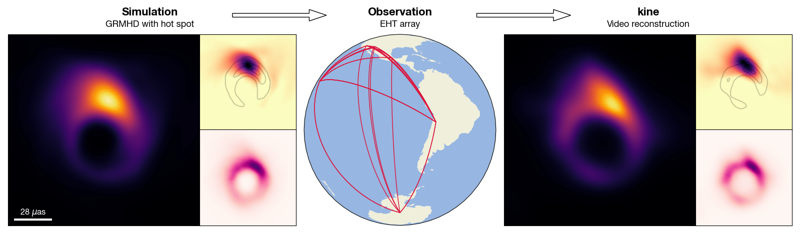

====
kine
====
(pronounciation: */ˈkine/*)

``kine`` is a Python package for video reconstruction of variable and sparse 
radio-interferometric data, from horizon-scale supermassive black holes to 
relativistic jets and more. It models the brightness distribution of the 
observed source in space, time, and frequency through a fully unsupervised 
neural field, parametrized by a coordinate-based neural network.

Built on `JAX <https://jax.readthedocs.io/>`_ and 
`Flax <https://flax.readthedocs.io/>`_, ``kine`` leverages GPU-accelerated 
automatic differentiation and JIT compilation for fast training. It uses and
complements the `eht-imaging <https://github.com/achael/eht-imaging>`_ library 
for VLBI data handling.

Imaging modes
-------------
``kine`` can be used for the following imaging tasks:

- **Static imaging**: reconstruct an image of the source from a single VLBI 
  observation.
- **Spectral imaging**: reconstruct the spectral dependence of the source 
  across multiple frequencies.
- **Dynamic imaging**: reconstruct a video of the source from a single VLBI 
  observation.
- **Multi-epoch imaging**: reconstruct a video of the source's evolution across 
  multiple observations spanning days to years.

Available Features
------------------
``kine`` currently supports:

- **Full polarimetric** video and image reconstruction (Stokes I, Q, U, V).
- **Static + dynamic decomposition**: in dynamic mode, separate persistent and 
  time-variable source structure.
- **Simultaneous gain fitting**: amplitude and phase telescope gains optimized 
  jointly with the image.
- **GPU-based NUFFT**: Non-Uniform Fast Fourier Transform for direct visibility 
  computation.
- **Multiple data products**: visibility amplitudes, closure phases, closure 
  amplitudes, bispectra, and complex polarization ratios.

**Coming soon:**

- Multi-epoch + spectral imaging
- Explicit modeling of the spectral dependence
- Scalability to large datasets

References
----------
If you use ``kine`` in your publication, please cite:

1. *[Main algorithm, Muti-epoch imaging, Static Imaging]* : Foschi M., Zhao B., 
   Fuentes A. et al. "Video reconstruction of variable VLBI observations with 
   neural fields". Accepted (2026).
2. *[Static + Dynamic decomposition, EHT SgrA* pipeline]* : Fuentes A., Foschi, 
   M., et al. "Validation of horizon-scale Sagittarius A* video reconstructions 
   with kine". Under review (2026).

Developers
----------
`kine` is developed and maintained by:

- Marianna Foschi (foschimarianna @ gmail . com)
- Antonio Fuentes (antoniofuentesfdez @ gmail . com)
- Brandon Zhao (byzhao @ caltech . edu)

If you would like support for using kine in your project or find an issue in the 
code please contact Marianna. If you would like support for installing the code 
on your machine please reach out to Brandon.

Documentation
-------------
.. toctree::
   :maxdepth: 2

   installation
   quick_start
   user_guide
   parameters
   api/index

